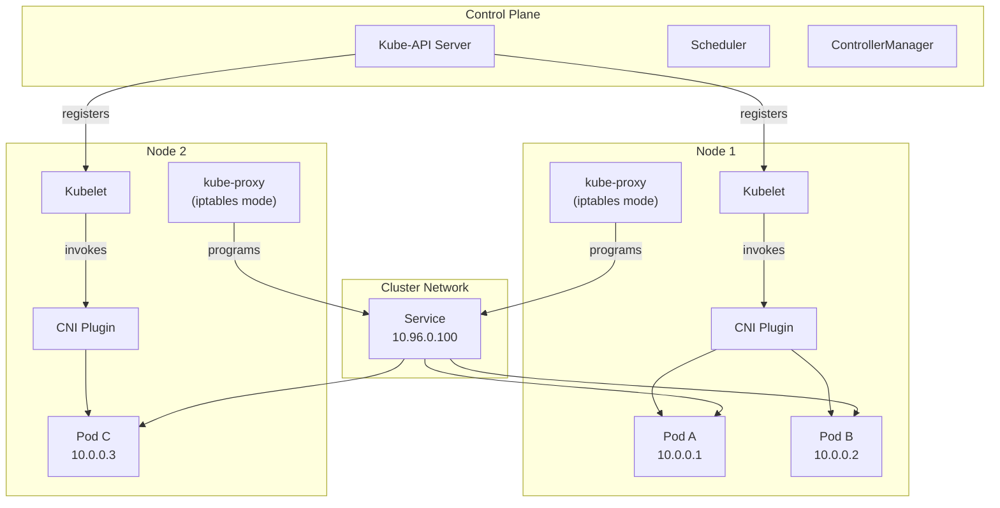

---

```mermaid
graph TD
    subgraph ControlPlane["Control Plane"]
        APIServer[Kube-API Server]
        Scheduler
        ControllerManager
    end

    subgraph Node1["Node 1"]
        Kubelet1[Kubelet]
        KProxy1["kube-proxy<br>(iptables mode)"]
        CNID1[CNI Plugin]
        Pod1[Pod A<br>10.0.0.1]
        Pod2[Pod B<br>10.0.0.2]
    end

    subgraph Node2["Node 2"]
        Kubelet2[Kubelet]
        KProxy2["kube-proxy<br>(iptables mode)"]
        CNID2[CNI Plugin]
        Pod3[Pod C<br>10.0.0.3]
    end

    subgraph ClusterNetwork["Cluster Network"]
        SVC[Service<br>10.96.0.100]
    end

    %% Control Plane → Nodes
    APIServer -->|registers| Kubelet1
    APIServer -->|registers| Kubelet2

    %% Pod creation
    Kubelet1 -->|invokes| CNID1
    CNID1 --> Pod1
    CNID1 --> Pod2

    Kubelet2 -->|invokes| CNID2
    CNID2 --> Pod3

    %% kube-proxy programs iptables for Service IP
    KProxy1 -->|programs| SVC
    KProxy2 -->|programs| SVC

    %% Service routes to backend Pods
    SVC --> Pod1
    SVC --> Pod2
    SVC --> Pod3

```

