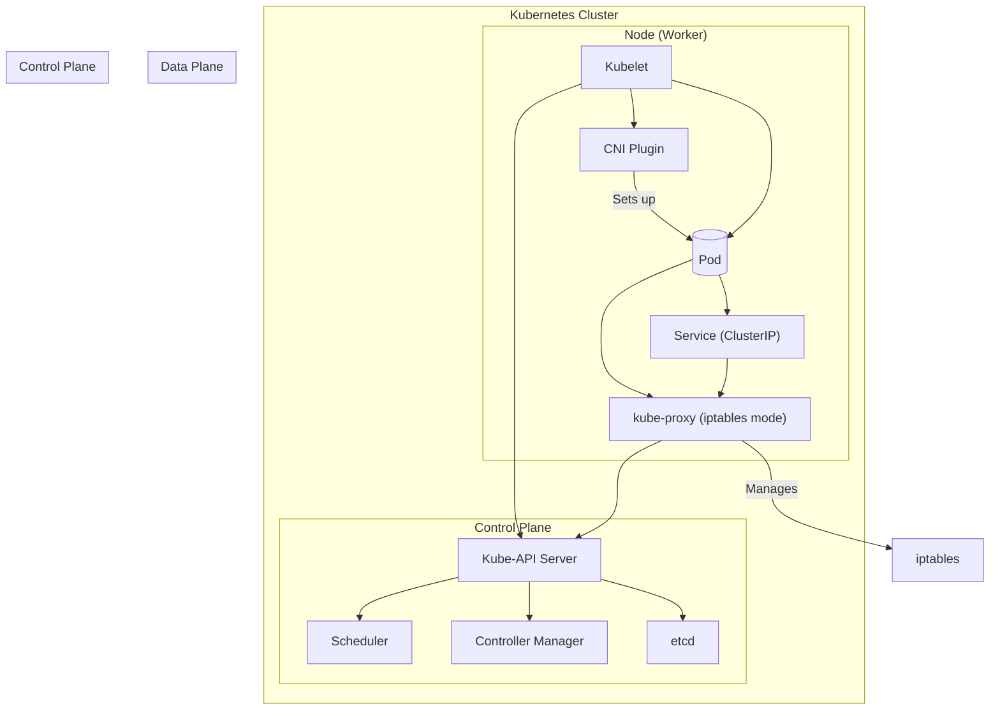
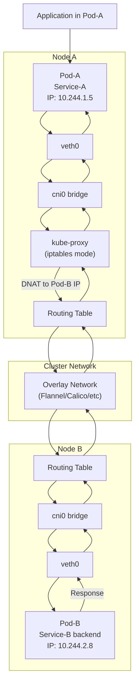
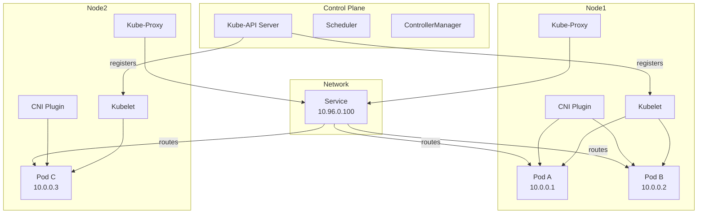
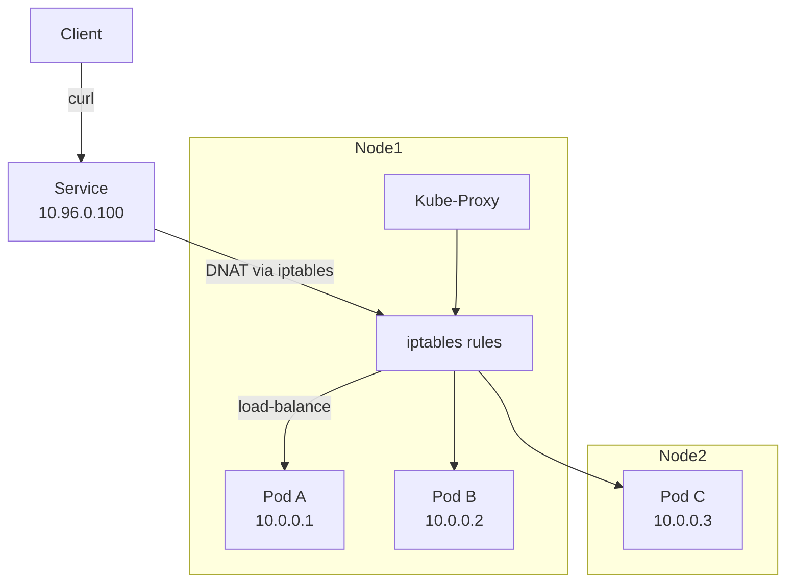
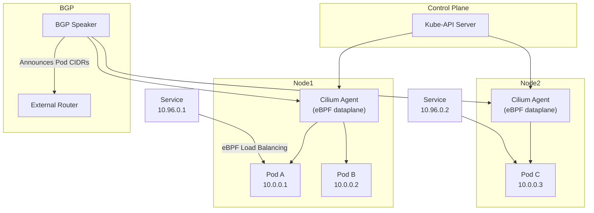

```mermaid
flowchart TD
  subgraph KubernetesCluster [Kubernetes Cluster]
    subgraph Node1 ["Node (Worker)"]
      Pod1[("Pod")]
      Service1["Service (ClusterIP)"]
      Kubelet1[Kubelet]
      KubeProxy1["kube-proxy (iptables mode)"]
      CNIPlugin1["CNI Plugin"]
    end

    subgraph ControlPlane [Control Plane]
      APIServer[Kube-API Server]
      Scheduler[Scheduler]
      ControllerManager[Controller Manager]
      Etcd[etcd]
    end
  end

  subgraph DataPlane ["Data Plane"]
    Pod1
    Service1
    KubeProxy1
  end

  subgraph ManagementPlane ["Control Plane"]
    Kubelet1
    CNIPlugin1
    APIServer
    Scheduler
    ControllerManager
    Etcd
  end

  %% Relations
  Pod1 --> Service1
  Pod1 --> KubeProxy1
  Service1 --> KubeProxy1
  KubeProxy1 -->|Manages| iptables
  Kubelet1 --> CNIPlugin1
  Kubelet1 --> APIServer
  CNIPlugin1 -->|Sets up| Pod1
  Kubelet1 --> Pod1
  KubeProxy1 --> APIServer

  APIServer --> Etcd
  APIServer --> Scheduler
  APIServer --> ControllerManager
```

---

```mermaid
flowchart TD
    subgraph NodeA["Node A"]
        PodA[Pod-A<br>Service-A<br>IP: 10.244.1.5]
        vethA[veth0]
        bridgeA[cni0 bridge]
        kubeProxyA["kube-proxy<br>(iptables mode)"]
        routeA[Routing Table]
    end

    subgraph ClusterNetwork["Cluster Network"]
        overlay["Overlay Network<br>(Flannel/Calico/etc)"]
    end

    subgraph NodeB["Node B"]
        PodB[Pod-B<br>Service-B backend<br>IP: 10.244.2.8]
        vethB[veth0]
        bridgeB[cni0 bridge]
        routeB[Routing Table]
    end

    App[Application in Pod-A] --> PodA
    PodA --> vethA --> bridgeA --> kubeProxyA
    kubeProxyA -->|DNAT to Pod-B IP| routeA --> overlay
    overlay --> routeB --> bridgeB --> vethB --> PodB

    PodB -->|Response| vethB --> bridgeB --> routeB --> overlay
    overlay --> routeA --> kubeProxyA --> bridgeA --> vethA --> PodA
```

---

```mermaid
graph TD
    subgraph Control Plane
        APIServer[Kube-API Server]
        Scheduler
        ControllerManager
    end

    subgraph Node1
        Kubelet1[Kubelet]
        KProxy1[Kube-Proxy]
        CNID1[CNI Plugin]
        Pod1[Pod A<br>10.0.0.1]
        Pod2[Pod B<br>10.0.0.2]
    end

    subgraph Node2
        Kubelet2[Kubelet]
        KProxy2[Kube-Proxy]
        CNID2[CNI Plugin]
        Pod3[Pod C<br>10.0.0.3]
    end

    subgraph Network
        SVC[Service<br>10.96.0.100]
    end

    APIServer -->|registers| Kubelet1
    APIServer -->|registers| Kubelet2
    Kubelet1 --> Pod1
    Kubelet1 --> Pod2
    Kubelet2 --> Pod3
    CNID1 --> Pod1
    CNID1 --> Pod2
    CNID2 --> Pod3
    SVC -->|routes| Pod1
    SVC -->|routes| Pod2
    SVC -->|routes| Pod3
    KProxy1 --> SVC
    KProxy2 --> SVC
```

---

```mermaid
graph TD
    subgraph Node1
        Pod1[Pod A<br>10.0.0.1]
        Pod2[Pod B<br>10.0.0.2]
        KProxy[Kube-Proxy]
        IPT[iptables rules]
    end

    subgraph Node2
        Pod3[Pod C<br>10.0.0.3]
    end

    Service[Service<br>10.96.0.100]
    Client[Client]

    Client -->|curl| Service
    Service -->|DNAT via iptables| IPT -->|load-balance| Pod1
    IPT --> Pod2
    IPT --> Pod3
    KProxy --> IPT
```
---

```mermaid
graph TD
    subgraph Node1
        Pod1[Pod A<br>10.0.0.1]
        Pod2[Pod B<br>10.0.0.2]
        Cilium1["Cilium Agent<br>(eBPF dataplane)"]
    end

    subgraph Node2
        Pod3[Pod C<br>10.0.0.3]
        Cilium2["Cilium Agent<br>(eBPF dataplane)"]
    end

    subgraph Control Plane
        KubeAPI[Kube-API Server]
    end

    subgraph BGP
        BGP1["BGP Speaker"]
        Router[External Router]
    end

    Service1[Service<br>10.96.0.1]
    Service2[Service<br>10.96.0.2]

    Cilium1 --> Pod1
    Cilium1 --> Pod2
    Cilium2 --> Pod3

    Service1 -->|eBPF Load Balancing| Pod1
    Service2 --> Pod3

    BGP1 -->|Announces Pod CIDRs| Router
    BGP1 --> Cilium1
    BGP1 --> Cilium2
    KubeAPI --> Cilium1
    KubeAPI --> Cilium2
```