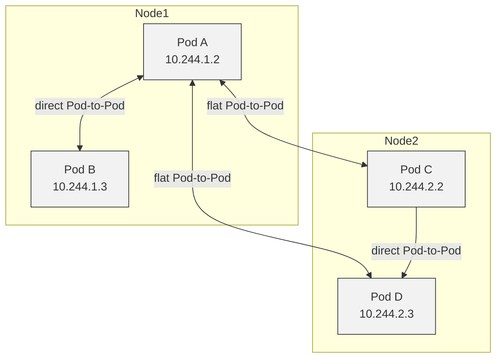
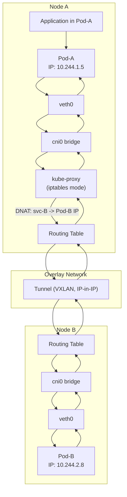
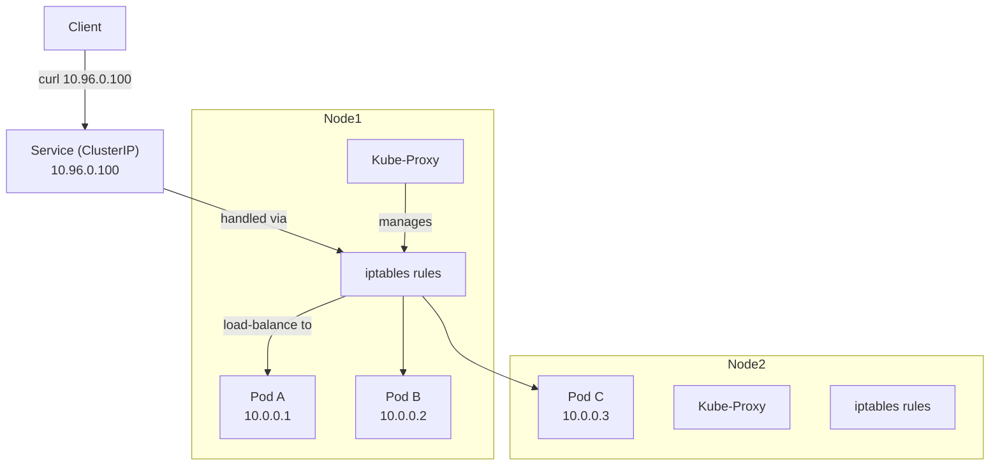
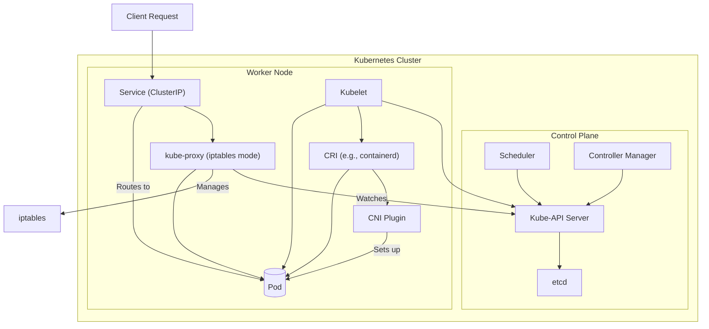
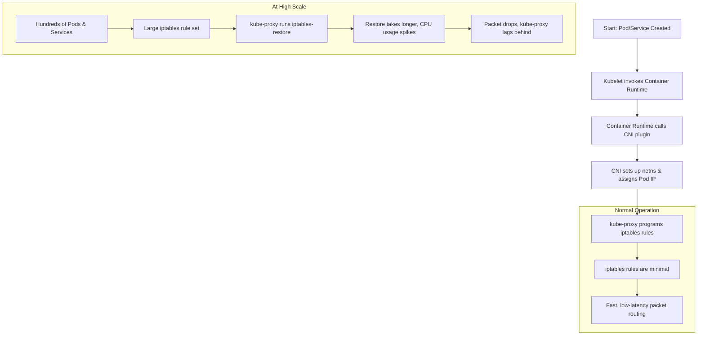
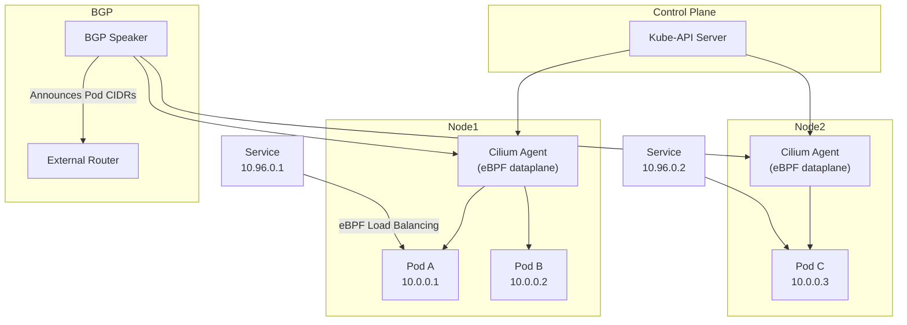
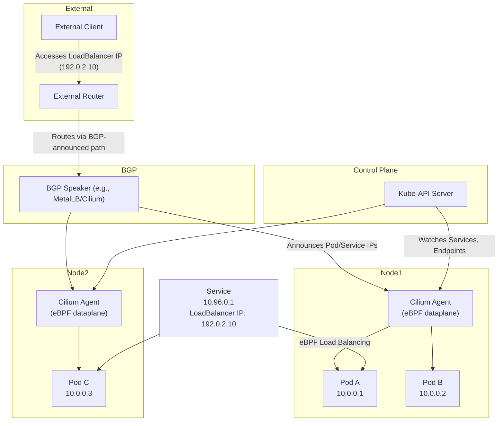

# # CNCF-MY network k8s

This project is designed to help users understand the fundamentals of IPTABLES, BGP (Border Gateway Protocol), and various networking aspects of Kubernetes (K8S). It provides hands-on examples and scripts to explore these topics in depth.

## Prerequisites

- Docker
- Kubernetes cluster (Minikube, Kind, or any cloud provider) _kind is recommended since all proof of concept scripts are tested on it._
- Any other dependencies required for the project.

## Installation

Clone the repository:

## Usage

*Give permission to the scripts that you want to run unsing*

```bash
chmod +x script-name.sh
```

To create a new Kubernetes cluster using Kind:

```bash
kind create cluster --name happy-path --config ./configs/kind-config.yaml

or

kind create cluster --name happy-path --config ./configs/kind-bgp.yaml
```

*Please note that `--name` is important as `docker exec` will use this name to run the commands inside the cluster.*

To clean up and delete the cluster:

```bash
kind delete cluster --name happy-path
```

### The idea behind kubernetes networking philosophy

#### Flat networking structure


The above diagram illustrates the flat networking structure of Kubernetes, where all pods can communicate with each other directly using their IP addresses. This is made possible by the Container Network Interface (CNI) plugin, which sets up the necessary networking rules.


#### But how is pod-to-pod communication achieved?




#### What happens when we add a service?



#### So in total we have:



#### How did I break my cluster?



#### How does BGP does networking?




## Contributing

Contributions are welcome! Please clone and submit a pull request.
